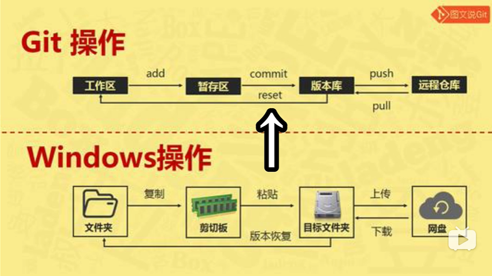
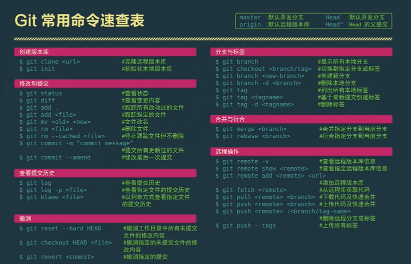

# git使用教程
*****

## 1. 安装git
> 前往官网下载 git: https://git-scm.com/download/win
>> 自己判断 32bit 或 64bit

## 2. 默认安装
> 安装完后，顺利的话一般右键会多出两个选项
>### ```Git GUI Here```
>> 带图形化界面的操作  
>### ```Git Bash Here```
>> 命令行形式的界面操作
>> 普遍使用此操作

## 3. github 创建新仓库
> 右上角有个 your repositories 创建一个新的仓库  
> 创建完后列表中有个 clone or download 的按钮  
> 里面有个受密码保护的 **SSH 地址** 格式如下: 
>>  ``` git@github.com:你的名字/仓库名称.git ```

## 4. git参数编辑(很多人因为这一步而后面出错)
> 创建完仓库，并且安装完 git ，接下来就要配置一些参数了
> ### 1. git账户邮箱绑定
>> ``` git config --global user.name" 用户名称 " ```  
>> ``` git config --blobal user.email" 登录邮箱 " ```
> ### 2. 生成**密钥**
>> ``` ssh-keygen -t rsa -C " 登录邮箱 " ```  
>> 输入这段代码后，顺利的话在个人用户的文件夹下会生成一个.ssh的文件夹，
>> 其中：id_rsa 是**私密**的 ssh密钥（不要公开哦），而id_rsa.pub 是**公共**的密钥，
>> 用记事本打开公钥，复制文本
> ### 3. 前往git 添加密钥
>> 右上角下拉菜单->setting->SSH and GPG keys(SSH和GPG密钥)，
>> 添加密钥，title(标题) 可以随你填，将前面复制的内容复制在 key(密钥) 上  
>> 创建好一个新的密钥

## 5. 目录初始化与添加项目
> 在你要上传的文件夹目录下，右键打开 ``` Git Bash Here ```  
> 并输入:   ``` git init ```  
> 初始化该目录，生成一个隐藏的 .git 文件夹，用于存放备份文件(暂存区)  
> 添加项目：  
> ``` git remote add origin <项目SSH地址> ```  
> 这样就让本地仓库和git上面的仓库保持同步了 

## 6. 目录代码常用功能
> 复制(拷贝)仓库中的代码下来到本地  
> ``` git clone <项目SSH地址> ```  
> 将本地代码保存到暂存区  
> ``` git add ```  
> 将暂存区的代码提交到本地仓库  
> ``` git commit -m"<说明或注释>" ```  
> 将本地仓库的代码上传(同步)到git仓库  
> ``` git push ```  
> 将git仓库的代码拉取(获取)到本地仓库  
> ``` git pull ```  



